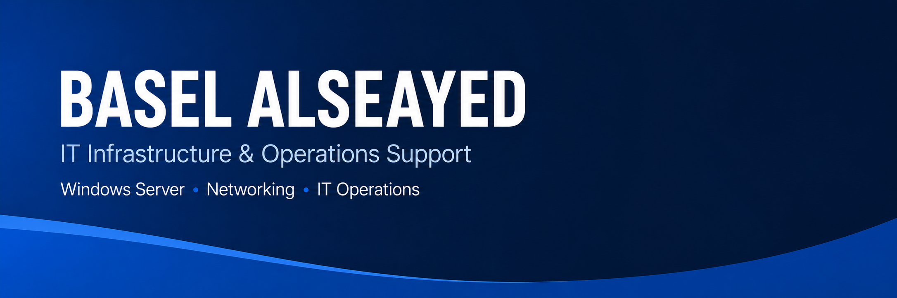

  

<h1 align="center">Hi 👋</h1>

  <b>IT Associate | Infrastructure & IT Operations Support</b>

  Windows Server • Active Directory • Networking • Group Policy • Backup & Recovery

  <a href="https://www.linkedin.com/in/balseayed">LinkedIn</a>

---

## 👨‍💻 About Me

I work in IT support and operations, with hands-on experience supporting users, POS systems, printers, network connectivity, and Windows-based environments.

I am currently building practical infrastructure labs to improve my skills in Windows Server, Active Directory, Group Policy, File Server, Backup, and IT operations documentation.

My goal is to grow from daily IT support into stronger infrastructure and system administration roles.

---

## 🚀 Current Focus

* Windows Server Administration
* Active Directory Domain Services
* Group Policy Management
* DNS & DHCP
* File Server & NTFS Permissions
* Backup and Restore
* Networking Fundamentals
* IT Operations Documentation

---

## 🧪 Hands-on Labs

### Windows Server Labs

* [Windows Server Labs](Windows-Server)

Current lab topics:

* Active Directory & Group Policy
* File Server & NTFS Permissions
* Windows Server Backup & Recovery

---

## 🛠️ Technical Skills

  
  
  
  

---

## 📌 What I’m Building

I use this GitHub profile to document my hands-on learning journey in IT infrastructure.

Each lab includes:

* The goal of the lab
* Tools and environment used
* Screenshots and implementation steps
* Problems faced during the lab
* What I learned from the process

---

## 📫 Connect

* LinkedIn:<a href="https://www.linkedin.com/in/balseayed">balseayed</a>
